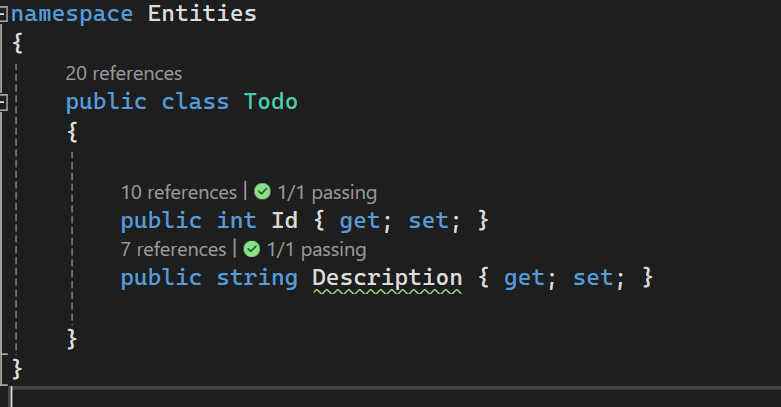

# TodoList

## Installation Instructions

1. Clone the repository.
2. Open the solution in Visual Studio
3. Compile and run the application.  (.NET 8)

## Comments 

Todo entity is defined as: ID, description
Example of description: "Sleep, go to play football"

## Comments about test

1. Test are in project TodoTestUnit
2. I use mocks for testing
3. Testing are for GET /api/todos

## Important

1. TodosController have a dependency injection of a repository that manage the list of todo
2. TodosController have a dependency injection of a featureflag to manage feature flags
3. TodosController have a dependency injection of a ILogger for logging errors.
4. Solid principles 
5. Used the Repository pattern
6. I also added Authcontroller for login with JWT and random users,  but for this instance y mark the controller TodoList as a [AllowAnonymous] for easiest check.
7. For this instance system only use a list in memory, not DB.
8. System have ILogger interface for logging errors.

## Solution

The solution have 4 projects: 

Entites: Project about the entites

Repository: Design pattern, acts as an intermediary layer between an application's business logic and controllers.

TodoList: API REST with controllers

TodoTestUnit: Project of TestUnit using XUnit framework

   